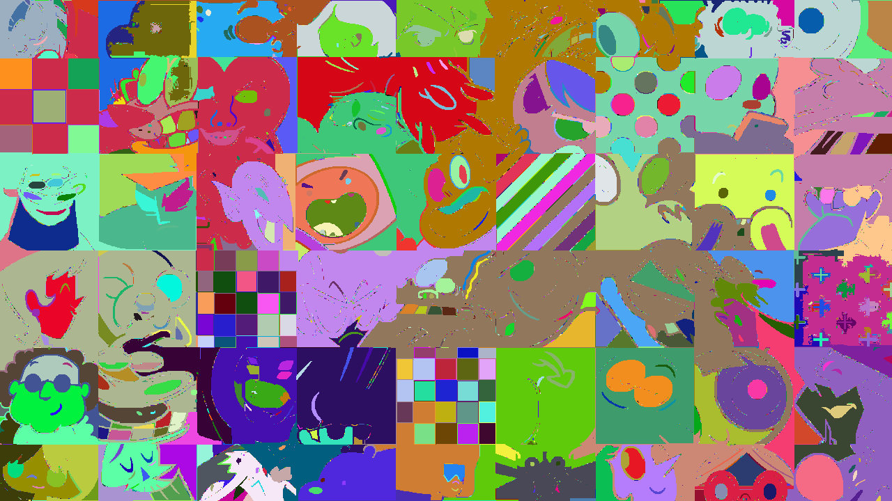
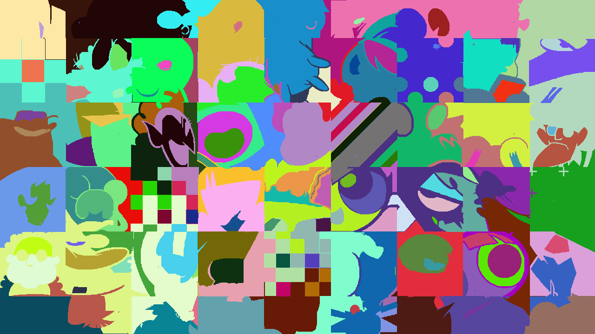
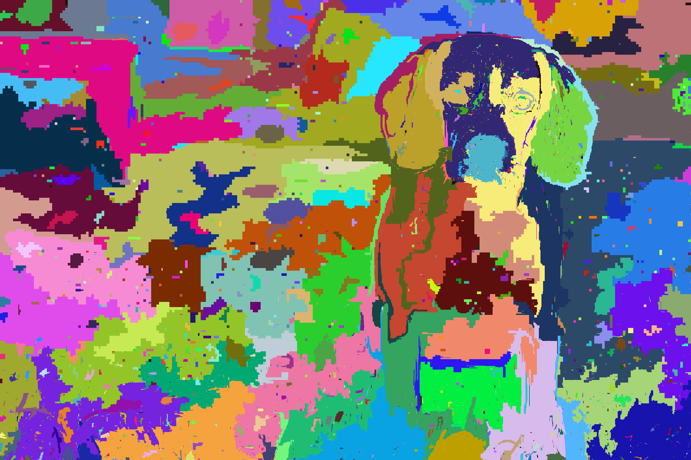
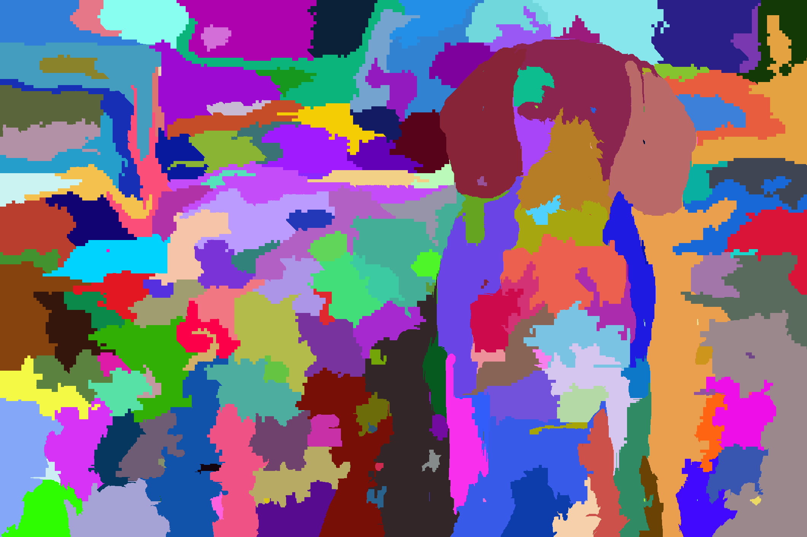

# Segmentação de Imagens via Teoria dos Grafos: Uma Análise Comparativa

## Visão Geral do Projeto

Este repositório documenta um projeto acadêmico desenvolvido para a disciplina de Teoria de Grafos e Computabilidade da PUC Minas, sob orientação do Prof. Silvio Jamil F. Guimarães. O objetivo central é a implementação, teste e análise comparativa de duas metodologias canônicas de segmentação de imagens que são fundamentalmente baseadas em Teoria dos Grafos.

O projeto explora como diferentes estratégias de particionamento de grafos — uma baseada em **Árvore Geradora Mínima** e outra em **Caminho Mínimo** — resultam em segmentações com características distintas, e avalia o comportamento desses algoritmos em diferentes tipos de imagem (gráficas e naturais, coloridas e em tons de cinza).

## Metodologias Implementadas

A imagem de entrada é modelada como um grafo, onde os pixels são os vértices e as arestas conectam pixels vizinhos. O peso de cada aresta é definido pela dissimilaridade (diferença de cor ou intensidade) entre os pixels. A partir deste modelo, duas abordagens foram implementadas.

### 1. Segmentação Baseada em Árvore Geradora Mínima (Felzenszwalb & Huttenlocher)

Esta técnica adota uma abordagem aglomerativa (*bottom-up*). Inicialmente, cada pixel é um segmento. O algoritmo processa as arestas do grafo em ordem crescente de peso e decide se deve unir os dois segmentos que a aresta conecta. A decisão é baseada em um predicado que compara o peso da aresta (diferença *externa*) com a diferença *interna* de cada segmento.

O comportamento é controlado pelo parâmetro de escala `k`, que ajusta a tolerância para a fusão: `k` alto favorece segmentos maiores, enquanto `k` baixo resulta em uma segmentação mais fina e detalhada.

### 2. Segmentação Baseada em Caminho Mínimo (Image Foresting Transform)

Esta abordagem, conhecida como IFT, modela a segmentação como uma competição. A partir de um conjunto inicial de pixels "semente", cada semente tenta conquistar os pixels vizinhos. Um pixel é atribuído ao segmento da semente que lhe oferece o caminho de menor custo.

O custo de um caminho é definido como o peso da aresta de maior valor encontrada ao longo dele (custo "max-arc"). O algoritmo é implementado eficientemente com uma fila de prioridade, de forma análoga a Dijkstra, para expandir sempre os caminhos de menor custo. O resultado é totalmente guiado pela posição e densidade das sementes iniciais.

## Arquitetura do Código

O projeto foi desenvolvido em C++17 com uma estrutura modular para separar responsabilidades:

* **`Imagem (.h, .cpp)`**: Classe responsável por toda a interação com arquivos de imagem. Utiliza as bibliotecas `stb_image` e `stb_image_write` para carregar imagens do disco para um array de pixels e para salvar os resultados.

* **`Grafo (.h, .cpp)`**: Atua como a classe de serviço principal que orquestra os algoritmos. Contém os métodos `segmentarFelzenszwalb()` e `segmentarIFT()`, que encapsulam a lógica de cada metodologia.

* **`UnionFind (.h, .cpp)`**: Estrutura de dados auxiliar (Disjoint Set Union) implementada para dar suporte eficiente ao algoritmo de Felzenszwalb, gerenciando a união dos conjuntos de pixels.

* **`main.cpp`**: Ponto de entrada que automatiza o processo de experimentação. Ele lê todos os arquivos de um diretório, executa ambos os algoritmos com uma variedade de parâmetros e salva os resultados para análise.

## Análise e Resultados

Os experimentos revelaram as características distintas de cada algoritmo.

| Imagem | Felzenszwalb (k=6000) | IFT (196 sementes) |
| :---: |:---:|:---:|
| **Gráfica (Cartoon)** |  |  |
| **Natural (Cachorro)** |  |  |

* **Felzenszwalb (AMG)** se mostrou excelente em preservar detalhes de textura e bordas fortes, mas muito sensível ao parâmetro `k` e propenso à supersegmentação em imagens complexas (como a foto do cachorro). Seu resultado é uma segmentação mais "literal", baseada em variações locais.

* **IFT (Caminho Mínimo)** produziu segmentos de fronteiras mais suaves e coesas. Seu sucesso, no entanto, é inteiramente dependente da estratégia de semeadura. Com sementes bem distribuídas, ele foi capaz de produzir uma segmentação semanticamente mais útil em imagens gráficas, agrupando "objetos" inteiros.

Conclui-se que não há um método universalmente superior; a escolha depende da aplicação. Felzenszwalb é mais adequado para uma análise não supervisionada e de textura, enquanto o IFT brilha em tarefas interativas ou quando o objetivo é obter regiões suaves e bem definidas a partir de um conhecimento prévio (as sementes).

## 👨‍💻 Autor

* **Matheus Fagundes Araújo**
